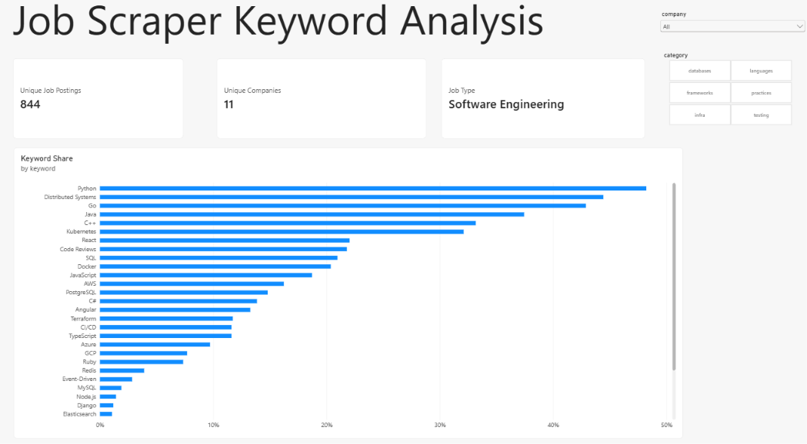

# Job_Keyword_Tracker

This Scrapes GreenHouse every day for Jobs & Stores them in Postgres and automates this process with Github Actions.

Using some regex, this is able to identify keywords in the job postings, compare with skills I have, and then automatically send myself an email of these job postings.

Tools: Python, Regex, NLP, AWS, Postgres.

And this shows some trends that I made in PowerBI

